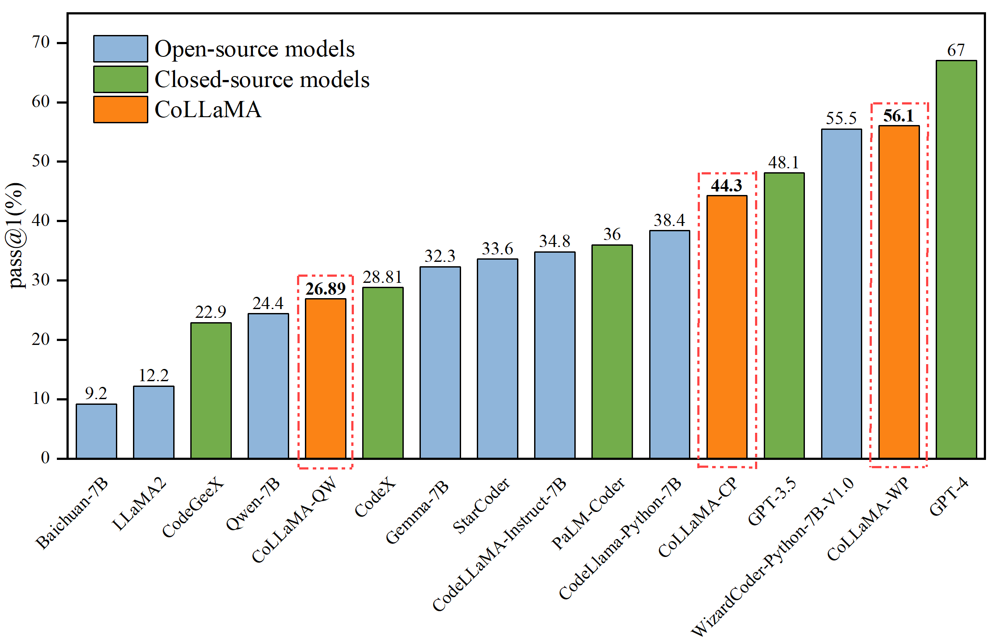

# CoMA: A Multi-task Instruction Tuning Dataset and Large Language Model for Code
[](https://github.com/tatsu-lab/stanford_alpaca/blob/main/LICENSE) 
[](https://www.python.org/downloads/release/python-390/)

This is the repository for the `CoMA` project, including the diverse, highquality instruction dataset CoMIT and the finely-tuned large model CoLLaMA. 

<p align="center" width="100%">

</p>

## Overview
Current code instruction datasets, which are essential for instruction-tuning tasks, are often disorganized, monolingual, and single-programming language focused, while covering an insufficient variety of tasks. Open-source datasets for instruction tuning in coding tasks are also scarce.

For this end, we propose this project, with the following advantages:
- `Multilingual Dataset`: Our dataset incorporates code samples from a multitude of programming languages including Java, Python, C, C#, Go, PHP, JavaScript, and Ruby et.al. It also presents code instructions in both Chinese and English, enabling the model to learn in various programming language and spoken language contexts, and thereby enhancing its generalization ability.
- `Task diversity`: The dataset spans a broad range of coding tasks, such as code summarization, code generation, code search, and others. It incorporates tasks with varying complexities and requirements, from beginner to advanced levels. This comprehensive approach ensures our instructions can handle different types of coding tasks and covers a broad spectrum of programming skills and knowledge.
- `Multi-programming paradigms`: The project includes code examples from different programming paradigms, such as procedural, object-oriented, functional, and event-driven programming. This wide coverage provides the instruction-tuning model with a varied set of coding tasks to learn from and generate instructions for.
- `Real-world code examples`: The dataset incorporates code snippets or excerpts from actual projects or forums such as StackOverflow and Github, to present more realistic and practical coding tasks. This aids the instruction-tuning model in generating instructions applicable to real-world scenarios.
- `Quality assurance`: We are committed to providing an accurate and high-quality dataset for each coding task. For instance, the instruction dataset for code search, extracted from programming posts on Stackoverflow Q&A sites, is rigorously filtered and cleaned to ensure its usability in real Q&A applications.

The repository contains the following:
- The `CoMIT` used for fine-tuning the model
- The code for fine-tuning the model
- Model weight
- The code for evaluation

## Dataset release
`data/` contains around 80k instruction-following data used for fine-tuning the CoLLaMA model.
This file is a list of dictionaries, each dictionary contains the following fileds:
- `instruction`: describes the task that the model should perform. 
- `input`: optional code or context for the task. For example, if the instruction is 'Please summarize this PHP code.', the input is the PHP code.
- `output`: the answer to the instruction. 

All data in our collection is formatted into the same templates, where each sample is as follows:
```
[
{"instruction":  `string`,
"input":  `string`, # (may be empty)
"output": `string`}
]
```

Due to the different code tasks, we choose which filed to generate with  `gpt-3.5-turbo` or human. Unlike `self-struct` technology to generate data, most of the code in our data comes from the real world, whereas some instruction choices are generated by `gpt-3.5-turbo`. The detailed process of data processing is described in the next section.

## Dataset Collection & Processing
It includes 8 datasets for 8 diversited code tasks covering the following scenarios:
* **[Code-to-Text](data/code-to-text/)**
   * **code summarization**: It aims to generate concise and readable summaries or description of source code. It involves automatically generating human-readable explations or summaries of code snippets, functions, or entire programs.
* **[Code-to-Code](data/code-to-code/)**

   * **Clone Detection**: Given a piece of code, find another piece of code that is semantically related to it.
   * **Defect Detection**: Given a source code, the task is to clarify what the specific defect of the code is. This include common errors such as null pointer, dereferences, array out of bounds, memory leaks, etc.
   * **Code Completion(line level)**: Complete the unfinished line given previous context. 
   * **Code Repair**: It aims to automatically fix bugs in the code.
   * **Code Translation**: Code translation refers to the process of converting source code from one programming language to another. It involves transforming the syntax, structure, and semantics of the original code while preserving its functionality and behavior.

* **[Text-to-Code](data/text-to-code/)**
   
   * **Code Generation**: According to the natural languages input by the user, the corresponding code is generated.
   * **Code Search**: Given a natural language query and mutiple code snippets, the task is to search source code that its function matches the natural languag query.

A brief summary of CoMIT is given below:

<table border= "1" width= "800" align="center">
     <tr bgcolor="#D3D3D3">
        <td colspan=4 align="center">Task</td>  
        <td align="center">Source Dataset name</td>  
        <td align="center">Num</td>  
        <td align="center">Lang</td>  
        <td align="center">Programming Lang</td>
     </tr>
     <tr>
        <td colspan=3 rowspan=2 align="center">Code to Text</td>  
        <td rowspan=2 align="center">Code Summarization</td>  
        <td align="center">CodeSearchNet</td>  
        <td align="center">10k</td>  
        <td align="center">EN</td>  
        <td align="center">Go,Java,JavaScript,PHP,Python,Ruby</td>
     </tr>
     <tr>
        <td align="center">CodeSearchNet</td>
        <td align="center">10K</td>
        <td align="center">CN</td>
        <td align="center">Go,Java,JavaScript,PHP,Python,Ruby</td>
     </tr>
     <tr>
        <td colspan=3 rowspan=6 align="center">Text to Code</td>
        <td rowspan=4 align="center">Code Generation</td>  
        <td align="center">CodeSearchNet</td>  
        <td align="center">10k</td>  
        <td align="center">EN</td>  
        <td align="center">Go,Java,JavaScript,PHP,Python,Ruby</td>
     </tr>
     <tr>  
        <td align="center">codealpaca</td>  
        <td align="center">20k</td>  
        <td align="center">EN</td>  
        <td align="center">C++,C,Java,JavaScript,PHP,Python,SQL etc.</td>
     </tr>
     <tr>
        <td align="center">CodeGPT</td>
        <td align="center">20k</td>
        <td align="center">CN</td>
        <td align="center">C#,C,C++,Go,Java,JavaScript,PHP,Python,Ruby</td>
     </tr> 
        <td align="center">CodeSearchNet</td>  
        <td align="center">5k</td>  
        <td align="center">CN</td>  
        <td align="center">Go,Java,JavaScript,PHP,Python,Ruby</td>
     </tr>
     <tr>
        <td colspan=1 rowspan=2 align="center">Code Search</td>  
        <td align="center">CodePro</td>  
        <td align="center">10K</td>  
        <td align="center">EN</td>  
        <td align="center">Python,SQL</td>
     </tr>
     <tr>
        <td align="center">CodePro</td>
        <td align="center">5k</td>
        <td align="center">CN</td>
        <td align="center">Python,SQL</td>
     </tr>
     <tr>  
        <td colspan=3 rowspan=5 align="center">Code to Code</td>  
        <td align="center">Clone Detection</td>  
        <td align="center">BigCloneBench</td>
        <td align="center">10k</td>
        <td align="center">EN</td>  
        <td align="center">Java</td>
     </tr>
     <tr>
        <td align="center">Defect Detection</td>  
        <td align="center">Devign</td>  
        <td align="center">5K</td> 
        <td align="center">EN</td>   
        <td align="center">C</td>
     </tr>
     <tr>
        <td align="center">Code Completion(line level)</td>  
        <td align="center">CodeSearchNet</td>  
        <td align="center">5K</td>  
        <td align="center">EN</td>  
        <td align="center">Go,Java,JavaScript,PHP,Python,Ruby</td>
     </tr>
     <tr>
        <td align="center">Code Repair</td>  
        <td align="center">Bug2Fix</td>  
        <td align="center">5K</td>  
        <td align="center">EN</td>  
        <td align="center">Java</td>
     </tr>
     <tr>
        <td align="center">Code Translation</td>  
        <td align="center">CodeTrans</td>  
        <td align="center">5k</td>  
        <td align="center">EN</td>  
        <td align="center">Java,C#</td>
     </tr>
</table>

We mainly obtained datasets from [CodeSearchNet](https://github.com/github/CodeSearchNet), [CodeXGLUE](https://github.com/microsoft/CodeXGLUE), [codeGPT](https://github.com/zxx000728/CodeGPT), [codealpaca](https://github.com/sahil280114/codealpaca) and [CodePro](https://github.com/hoogang/CodePro), processed them to obtain the aforementioned datasets, and concentrated them into one [dataset](data/CoMIT.json).

## Finetuning
We take the process a step further by utilizing the CoMA dataset to train CoLLaMA. Initially, we employ Qwen-7B(Original), CodeLlama-7B-Python and WizardCoder-Python-7B-V1.0 as the backbone models and fine-tune them using our proposed CoMIT multi-task code instruction following dataset. 

The fine-tuning process is basically followed [PIXIU](https://github.com/The-FinAI/PIXIU).

To reproduce a fine-tuned version of QWen, please follow the steps below.

In order to effectively finetune a `QWen-7b` model, we used Lora technology to train on an `A100 80GB` GPUs. Meanwhile, you need to adjust the training parameters according to your GPUs and dataset.

Before fine-tuning, first make sure to install all requirements using:

```bash
pip install -r requirements.txt
```

Below is the command to fine-tune QWen-7B using our dataset combined with LoRA technology on an "A100 80G" GPU machine.

```bash
torchrun --nproc_per_node=1 --master_port='29502' train_qlora.py --train_args_file QWen-7b-sft-lora.json
```
The main fine-tuning parameters are as follows:

```bash
"train_file": "/data/data.jsonl",
"num_train_epochs": 1,
"per_device_train_batch_size": 6,
"gradient_accumulation_steps": 2,
"learning_rate": 1e-5,
"max_seq_length": 512,
"logging_steps": 50,
"save_steps": 500,
"save_total_limit": 1,
"lr_scheduler_type": "constant_with_warmup",
"warmup_steps": 500,
"lora_rank": 64,
"lora_alpha": 16,
"lora_dropout": 0.05,
"gradient_checkpointing": true,
"optim": "paged_adamw_32bit",
"fp16": true,
"dataloader_num_workers": 0,
"save_strategy": "steps",
"weight_decay": 0,
"max_grad_norm": 0.3
```

You can replace `train_file` with your own dataset.

The above fine-tuning command only saves the weight and configuration file of the adapter, and needs to merge the weight of the adapter with the base model. Merge script see `merge_lora.py`. 

## Evaluation
After fine-tuning on 80K data using LoRA technique, we evaluated this model on [humaneval](https://github.com/openai/human-eval). The result is as follows：

<p align="center" width="100%">

</p>

We present self-reported evaluation results of various open and closed source models on HumanEval. The above figure illustrates the comparison between our fine-tuned model and the baseline model. Our fine-tuned CoLLaMA-WD model outperformed most open-source and closed-source models in the HumanEval evaluation, even surpassing the performance of the current SOTA model GPT-4 by reaching 83.7%. We released the CoLLaMA-WP model on [huggingface](https://huggingface.co/Denilah/CoMA-7B).

## Citation
<div>
<div align="center">
    <a target='_blank'>Gang Hu<sup>1</sup></span>&emsp;
    <a target='_blank'>Xi Wen<sup>1</sup></span>&emsp;
    <a target='_blank'>Xin Liu<sup>1</sup></a>&emsp;
    <a href='https://jimin.chancefocus.com/' target='_blank'>Jimin Huang<sup>2</sup></a>&emsp;  
    <a target='_blank'>Qianqian Xie*<sup>3</sup></a>&emsp;   
    
</div>
<div>
<div align="center">
    <sup>1</sup>School of Information Science & Engineering, Yunnan University&emsp;
  <sup>2</sup>ChanceFocus AMC&emsp;
   <sup>3</sup>School of Computer Science, Wuhan University&emsp;
</div>
   
```
@misc{Hu2023CoMA,
      title={CoMA: A Multi-task Instruction Tuning Dataset and Large Language Model for Code}, 
      author={Gang Hu and Xi Wen and Xin Liu and Jimin Huang and Qianqian Xie},
      year={2023},
}
```
</div>
</div>
